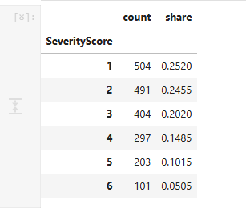

Complaint Severity Score Classification - Risk Aware ML Project

## Executive summary

This repository contains a complete, reproducible solution for predicting complaint **SeverityScore (1–6)** and supporting the operational triage rule:

- **1–3** → not progressed
- **4–6** → progressed for further investigation

The modelling objective is deliberately **not plain accuracy**. The brief states that failing to progress a genuinely severe case is materially more harmful than progressing a less-severe case. The final solution therefore combines a six-class CatBoost classifier with a **business-risk escalation layer** calibrated on out-of-fold probabilities. If the model's total probability that a case is severe (score ≥4) exceeds the calibrated threshold, a low argmax prediction is escalated to the most probable severe class.

What this means in plain language is that :CatBoost estimates,the escalation rule adds a safety check before a case predicted as 1–3 is allowed to be closed.

The deployable model excludes fields that appear downstream of the triage/decision process, reducing target leakage and making the reported validation results more credible for production use.

`CaseReference` is an identifier and is excluded from modelling. The deployable model also removes `InvestigationRoute`, `OmbudsmanInvestigationRequired`, `PredictedRemedyBand`, and `ExpectedFinancialRedressGBP` because they plausibly occur downstream of the decision being automated.

The Repository structure :

## Data audit

### Supplied data

- Training: **2,000 rows**, 46 columns including `SeverityScore`.
- Holdback: **500 rows**, 45 columns without the target.
- Target classes: 1–6.
- `CaseReference` is unique in the training data and is retained only as an output identifier, never as a feature.

Training target distribution:


The dataset is moderately imbalanced toward lower severity, which is why macro F1 and severe recall are reported in addition to accuracy.

### Missingness

Missingness is modest and concentrated in a handful of variables, with the largest rates in `FailureTypeSecondary`, `PrimaryVulnerability`, and `Jurisdiction`. CatBoost handles numeric missing values natively. Missing categorical values are converted to the explicit category `__MISSING__` so absence can carry signal without ad-hoc imputation.

Leakage assessment

The following fields are excluded from the production feature set because their descriptions suggest they may be downstream of, or tightly entangled with, the decision the model is intended to automate:

- `InvestigationRoute`
- `OmbudsmanInvestigationRequired`
- `PredictedRemedyBand`
- `ExpectedFinancialRedressGBP`

`CaseReference` is also excluded because it is an identifier.

A diagnostic model using all available columns performs materially better, which strengthens the leakage concern. The repository intentionally prioritises a defensible production design over an artificially inflated validation score.

`EstimatedImpactScore` and `EstimatedRiskScore` are retained because the supplied materials describe them as internal assessments and do not state that they occur after the severity decision. Their availability timing is therefore an explicit **pre-triage assumption**. If these scores are produced after severity assessment, they must also be removed and the model retrained.

## Feature engineering

Feature engineering is intentionally conservative and reproducible:

1. Parse `CaseCreatedDate` using the supplied DD/MM/YYYY representation.
2. Derive year, month, quarter, and day-of-week.
3. Remove the raw date.
4. Remove identifier and leakage-risk fields.
5. Represent missing categorical values as `__MISSING__`.
6. Pass numeric features directly to CatBoost, preserving missing numeric values.

No target-derived aggregates are created.

Model choice

### Champion: CatBoost multiclass classifier

CatBoost is well suited to this dataset because it:

- handles mixed numeric and categorical features without one-hot feature explosion;
- handles nonlinear interactions between impact, vulnerability, duration, financial and service-failure variables;
- handles missing numeric values;
- is robust on medium-sized tabular datasets;
- exposes feature importance and SHAP-compatible explanations;
- serialises cleanly for deterministic inference.

The model predicts all six severity classes directly. The ordinal structure is additionally assessed using quadratic weighted kappa and absolute class error.

## Validation strategy

The training script uses **3-fold stratified out-of-fold validation** with a fixed random seed. Threshold selection is performed only on out-of-fold probabilities, avoiding calibration on in-sample predictions.

Current reproducible validation results are stored in `artifacts/validation_metrics.json`. The latest run gives approximately:

The risk overlay intentionally sacrifices a small amount of headline multiclass accuracy to reduce severe-case false negatives by roughly 69%. This is the preferred operating point because it reflects the stated organisational risk asymmetry.

## 7. Business-risk calibration

For each out-of-fold case:

```text
P(severe) = P(score=4) + P(score=5) + P(score=6)
```

The training code searches thresholds from 0.20 to 0.60 and selects the threshold minimising:

```text
risk_cost = 5 × severe_false_negatives + low_severity_false_positives
```

Ties are broken using macro F1. The selected threshold is saved in model metadata and used by `predict.py`.

For production, I would recommend moving from the illustrative 5:1 ratio to a formally agreed control, for example:

- severe recall ≥ 97%;
- score-6 recall ≥ a policy-defined minimum;
- maximum tolerated false-closure rate per month;
- manual review for low-confidence cases around the 3/4 boundary.

## 8. Explainability

`artifacts/feature_importance.csv` contains global CatBoost feature importance. The strongest drivers in the fitted leakage-controlled model include:

- `EstimatedImpactScore`;
- `EstimatedRiskScore`;
- `EmotionalImpactLevel`;
- `PhysicalImpactLevel`;
- `RecoveryTimeMonths`;
- `DurationAffectedDays`;
- `VulnerabilityLevel`.

This direction is substantively consistent with the assessment brief. For a production service, SHAP explanations should be generated for analyst review, accompanied by clear warnings that explanations describe the model's prediction, not causal impact.

## 9. Running the solution

### Environment

Python 3.11+ is recommended.

```bash
python -m venv .venv
# Windows
.venv\Scripts\activate
# macOS / Linux
source .venv/bin/activate

pip install -r requirements.txt
pip install -e .
```

### Train and evaluate

```bash
python train.py \
  --train data/training_dataset.csv \
  --artifacts artifacts \
  --folds 3
```

This writes the validation metrics, final CatBoost model, model metadata, and feature importance.

### Predict the holdback set

```bash
python predict.py \
  --input data/holdback_dataset.csv \
  --model artifacts/severity_model.cbm \
  --metadata artifacts/model_metadata.joblib \
  --output predictions.csv
```

The required output schema is:

```text
CaseReference,PredictedSeverityScore
```

### Run tests

```bash
pytest -q
```

Current test suite: **3 tests passing**. Tests cover leakage/identifier removal, date/categorical preprocessing, and the business-risk escalation rule.

## Reproducibility controls

- fixed random seed;
- pinned Python dependencies;
- deterministic feature-engineering functions;
- no use of `CaseReference` as a predictor;
- threshold calibrated from out-of-fold predictions only;
- persisted model metadata including exact feature ordering and chosen threshold;
- inference-time schema validation;
- unit tests;
- container definition and CI workflow.

Key assumptions and limitations

- The supplied data are synthetic, so validation results should not be interpreted as real-world operational performance.
- The 5:1 business-cost ratio is an explicit modelling assumption introduced for this assessment.
- `EstimatedImpactScore` and `EstimatedRiskScore` are assumed to be available before severity assignment; this must be verified.
- The data dictionary omits two supplied fields noted above.
- A 2,000-row training set is adequate for a take-home demonstration but too small to establish robust subgroup performance or rare-event safety guarantees.
- Automatic closure should not be enabled solely on the basis of offline validation; shadow deployment and human review are recommended first.
